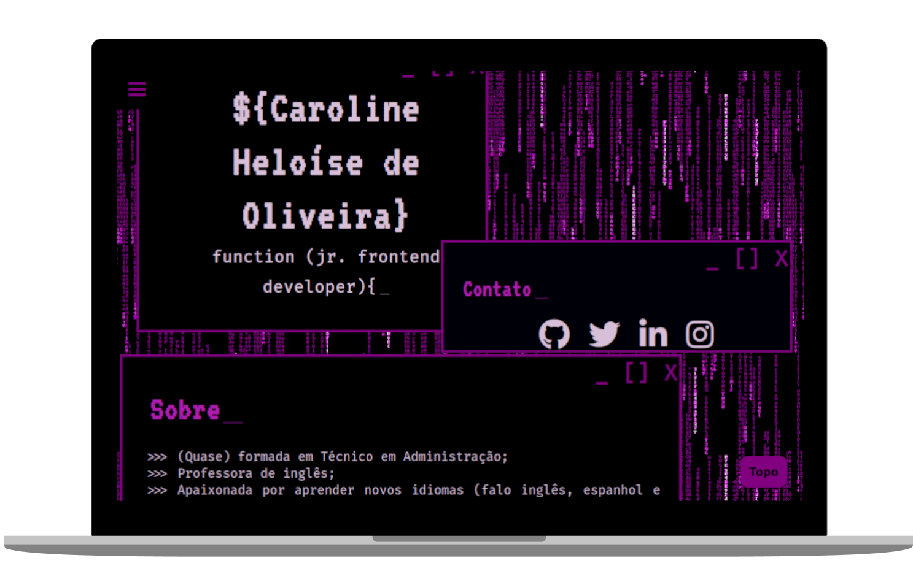

<div id="topo"></div>
<h1 align='center'>
    
</h1>

<h2 align='center'>Minha primeira página web</h2>

<p align="center"><i>“Don't think you are, know you are" ~Morpheus, 'The Matrix' (1999)</i> </p>

<div align="center">
    
    
    
    
    
</div>

<div align="center">


</div>

<h3 align='center'>:link:<a href='https://meu-site-pessoal-carol42.vercel.app/' target='_blank'> Acessar a demonstração</a></h3>
<h4 align="center">:us::gb: <a href="./README-en.md">Go to the English version of this README »</a>
</h4>

<details>
    <summary>Sumário</summary>
    <ol>
        <li><a href="#pushpin-sobre">Sobre</a></li>
        <li><a href="#diving_mask-a-imersão">A Imersão</a></li>
        <li><a href="#wrench-tecnologias-e-recursos-utilizados">Tecnologias e recursos utilizados</a></li>
        <li><a href="#computer-como-baixar-e-rodar-o-projeto">Como baixar e rodar o projeto</a></li>
        <li><a href="#woman_technologist-a-desenvolvedora">A desenvolvedora</a></li>
    </ol>
</details>

## :pushpin: Sobre
Essa foi a primeira página web que eu desenvolvi e que me motivou a seguir no mundo da programação.

Eu gosto de poder olhar pra trás nos meus primeiros códigos e observar a minha evolução, portanto não pretendo tirar esse site do ar ou fazer alterações posteriores. Apenas adicionei esse README para que eu pudesse documentar alguns pontos importantes sobre ele.

<div>
    <div>
        
    </div>
    <div>
        
    </div>
</div>

<p align="right"><a href="#topo"></a></p>

## :diving_mask: A Imersão

O site foi desenvolvido durante a <a href="https://www.alura.com.br/imersao-css">Imersão CSS</a>, promovida pela <a href="https://www.alura.com.br/">Alura</a> e ministrada pelas instrutoras <a href="https://twitter.com/vanessametonini">Vanessa Tonini</a> e <a href="https://twitter.com/aquijuz">Juliana Amoasei</a>, com a participação especial de <a href="https://twitter.com/paulo_caelum">Paulo Silveira</a> entre os dias 11 e 15 de maio de 2020.

Os principais assuntos abordados foram: introdução ao CSS, deploy,  posicionamento, design responsivo, CSS grid, fontes e ícones, animações e efeitos.

Além da criação do portfólio, foram propostos dois desafios no CodePen: <a href="https://codepen.io/Carol42/pen/zYvQMGe">Loaders</a> e <a href="https://codepen.io/Carol42/pen/zYvXdmp">Abertura do Star Wars</a>.

<p align="right"><a href="#topo"></a></p>

    
## :wrench: Tecnologias e recursos utilizados
- [HTML](https://developer.mozilla.org/en-US/docs/Web/HTML)
- [CSS](https://developer.mozilla.org/en-US/docs/Web/CSS)
- [JavaScript](https://developer.mozilla.org/en-US/docs/Web/JavaScript)
- [Font Awesome](https://fontawesome.com/)
- [Google Fonts](https://fonts.google.com/)

<div align='center'>

</div>

<p align="right"><a href="#topo"></a></p>

## :computer: Como baixar e rodar o projeto

```bash
# Clonar o repositório
$ git clone https://github.com/Carol42/Meu-site-pessoal

# Entrar no diretório
$ cd Meu-site-pessoal

# Iniciar o projeto (Windows)
$ start index.html

# Iniciar o projeto (Linux - Debian-based distros)
$ xdg-open index.html

# Iniciar o projeto (MacOs)
$ open index.html
```
<p align="right"><a href="#topo"></a></p>

## :woman_technologist: A desenvolvedora


</br>
<strong>Caroline Heloíse de Oliveira</strong>
</br>
<sup>Estudante de Engenharia de Computação (UEPG)</sup>
</br>

<a href="https://github.com/Carol42"></a>
<a href="https://linkedin.com/in/carol42"></a>
<a href="mailto:carol42.helo@gmail.com"></a>
<p align="right"><a href="#topo"></a></p>
